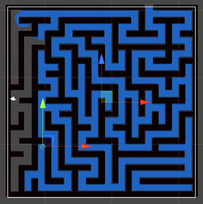

# Multicursal Maze Generator

A C# program that randomly generates multicursal mazes and includes a CPU that can traverse the maze using the breadth-first search algorithm. The program also allows users to navigate the maze using arrow keys.

## Table of Contents
- [Overview](#overview)
- [Images](#Images)
- [Installation](#installation)
- [Technologies Used](#technologies-used)

## Overview

The following project is a C# program designed to generate random multicursal mazes. A multicursal maze is a type of maze that includes multiple paths and intersections, providing a more complex and challenging environment for exploration. The program utilizes the breadth-first search algorithm to enable the CPU to navigate through the maze.

Users can also interact with the maze by using arrow keys to control their character's movement. This feature allows for manual exploration and adds an interactive element to the maze-solving experience. The program provides real-time visualization of the maze, the position of the player character, and the position of the CPU opponent.

## Images

Here are a few images showcasing the maze generator:

CPU Maze

Multicursal Maze

# Installation

To run the program, follow these steps:

1. Clone the repository: git clone https://github.com/n-alex-goncalves/Multicursal-Maze-Generator
2. Open the project in your preferred C# development environment (Unity for example)
3. Build the project to compile the source code.
4. Run the generated executable file to launch the program.

Make sure you have the necessary dependencies and a compatible C# development environment installed before proceeding with the installation.
